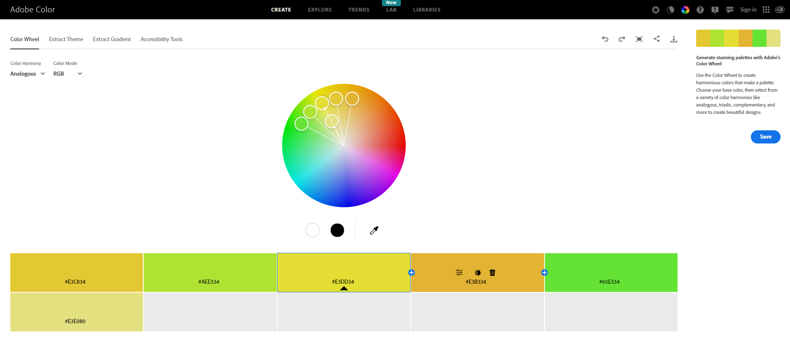
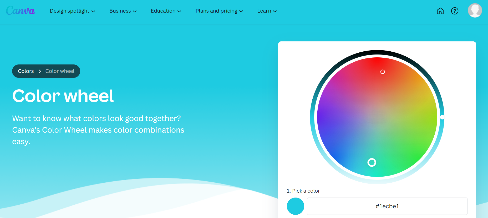

# voyage-project-tier2-color-explorer

## Table of Contents

* [Overview](#overview)
* [General Instructions](#general-instructions)
* [Requirements & Specifications](#requirements-specifications)
* [Acknowledgements](#acknowledgements)
* [About Chingu](#about-chingu)

## Overview

Hello Chingus!

Let's consider the importance of colors in our lives. These bright shades not only decorate our surroundings but also affect our feelings and thoughts every day. From the calming effect of gentle blues to the energizing power of vibrant greens, colors impact how we experience and express ourselves. However, many of us find ourselves struggling to find matching colors, whether for our outfits or interior design, often leading to frustration and uncertainty in our choices.

During this voyage, you will be building a color matching app. The app is intended to serve as a personal consultant, helping users find harmonious color combinations for various purposes, including outfit coordination, interior design, website design, graphic design projects, and more.

- [Color theory example site](https://color.adobe.com/create/color-wheel)

- [Color theory example site](https://www.canva.com/colors/color-wheel/)

This voyage takes an even more thrilling turn as Chingu introduces the integration of the OpenAI API for the first time. With this powerful tool at your disposal, you'll craft an innovative solution enabling users to uncover their ideal color combinations.

So, grab your color wheels and dive into coding!

## General Instructions

This project is designed to be worked on by a team rather than an individual
Chingu. This means you and your team will need to thoroughly read and
understand the requirements and specifications below, **_and_** define and
manage your project following the _Agile Methodology_ defined in the
[Voyage Handbook](https://github.com/chingu-voyages/Handbook/blob/main/docs/guides/voyage/voyage.md#voyage-guide).

As you create this project make sure it meets all of the requirements, but once
it reaches MVP, start implementing the optional features or get creative and
extend it in ways we haven't envisioned. In other words, use the power of
teamwork to make it distinctive and unique.

Take note that we haven't given specific direction on what your UI/UX should
look like. This is another area where you and your team can put your creativity 
to work! 

## Requirements & Specifications

### What You Need to Do

The following define the minimum requirements and ideas for features you may
implement to enhance this app, if time permits.

#### Structure

- [ ] This is a purely frontend application. No backend is required.
- [ ] You may use any languages, tools, or libraries you prefer when designing and building this app.
- [ ] You may **_NOT_** use AI-base solution generators like GitHub CoPilot.
- [ ] The app should facilitate connectivity to the OpenAI API for color recommendations.
- [ ] Useful links and resources:
  - [Wiki about Color Scheme](https://en.wikipedia.org/wiki/Color_scheme)
  - [OpenAI API docs](https://platform.openai.com/docs/introduction)
  - [Color picker library](https://iro.js.org/)

#### Styling

- [ ] Surprise us!!! Use your teams creativity to make this app distinctive.
- [ ] Add a footer containing a link to your teams GitHub repo.
- [ ] In general, you will find these [UI design principles](https://www.justinmind.com/ui-design/principles) helpful.
- [ ] Recommend using this resource for [clean CSS](https://israelmitolu.hashnode.dev/writing-cleaner-css-using-bem-methodology).

#### Functionality

-   Overview:
    - [ ] Develop a single-page application (SPA) or its equivalent to deliver intuitive color recommendation functionality to users.

- Data Capture and Processing
    - [ ] Integrate a color picker library or create a custom color palette allowing users to choose color from a predefined palette.
    - [ ] Incorporate a mechanism to prompt users for the context in which they intend to use the selected color. Include this context information in the prompt sent to the OpenAI API for more tailored color recommendations.

- API Connectivity and Response Handling
    - [ ] Establish connectivity to the OpenAI API for color analysis via provided API key.
    - [ ] Send the captured color data and the context to the OpenAI API as part of the prompt.
    - [ ] When sending color data to the OpenAI API, include it in the prompt along with a request for color recommendations. Ensure it also requests color codes with their respective names for the recommended colors. Example prompt:
      - "Suggest color recommendations based on the [selected color] and [context]"
      - "Color recomemmendations [selected color][context], provide color codes and explanation"
      - "Suggest compatible colors based on the [selected color] and [context]. Display color codes and descriptions"
    - [ ] Ensure robust error handling for API connectivity, data formatting, and response processing.
    - [ ] Retrieve and process the response from the OpenAI API.
    - [ ] Capture the color codes and text description provided by the OpenAI API in the response.

- Visual Representation
    - [ ] Visualize the response from the OpenAI API using colors and accompanying text.
    - [ ] Represent the AI-generated color response in a visually comprehensible manner within the application interface.

- User Experience
    - [ ] Ensure the application provides a seamless user experience for color selection, processing, and response visualization.
    - [ ] Implement intuitive UI/UX elements to guide users through the color capture and analysis process.

- Responsiveness
    - [ ] Ensure the web application is responsive and accessible across various devices and screen sizes.
    - [ ] Utilize responsive design techniques to adapt to different viewport sizes.

### Extras (Not Required)

- Color Capture and Processing
    - [ ] Utilize an integrated library or create a custom color palette for visually representing color recommendation responses.
    - [ ] Allow users to select multiple colors for analysis, enabling them to compare and contrast recommendations for different color combinations.
    - [ ] Implement a feature that suggests complementary, analogous, or triadic colors based on the user's selected color, helping them create harmonious color schemes.
    - [ ] Integrate a tool to simulate how color choices might appear to users with different types of color vision deficiencies, ensuring inclusivity in design decisions.

## Acceptance Criteria

- Data Capture and Processing
    - [ ] Users can accurately select color using the integrated color picker library or a custom color palette.
    - [ ] The selected color code and context are correctly formatted and included in the prompt sent to the OpenAI API for analysis.

- API Connectivity and Response Handling
    - [ ] The application must establish reliable connectivity to the OpenAI API for color analysis.
    - [ ] Response handling mechanisms should accurately interpret and extract relevant information from the API response.
    - [ ] Error handling must be implemented to gracefully manage any issues encountered during API communication.

- Visual Representation
    - [ ] The AI-generated color response should be visually represented in a clear and understandable manner within the application interface, effectively conveying the characteristics and attributes of the analyzed color along with their corresponding text descriptions.

## How to Obtain OpenAI API Key

  - Create an Account
    - [ ] Visit the [OpenAI API website](https://platform.openai.com) and create an account.
  - Navigate to API Keys
    - [ ] Once logged in, go to the API keys section in the navigation menu.
  - Generate a New Secret Key
    - [ ] Click on "Create New Secret Key" to generate your API key.
  - Note for Existing Users
    - [ ] If you are logged in with a ChatGPT account, you won't have access to a free OpenAI API key. Free keys are available for new users and are valid for three months.

## Acknowledgements

We express gratitude to the [OpenAI](https://openai.com) team for providing access to their API, enabling us to incorporate advanced color analysis capabilities into our application.
Additionally, we appreciate the contributions of the wider developer community whose insights and expertise continually enrich our projects.

## About Chingu

If you aren’t yet a member of Chingu we invite you to join us. We help our
members transform what they’ve learned in courses & tutorials into the
practical experience employers need and want.